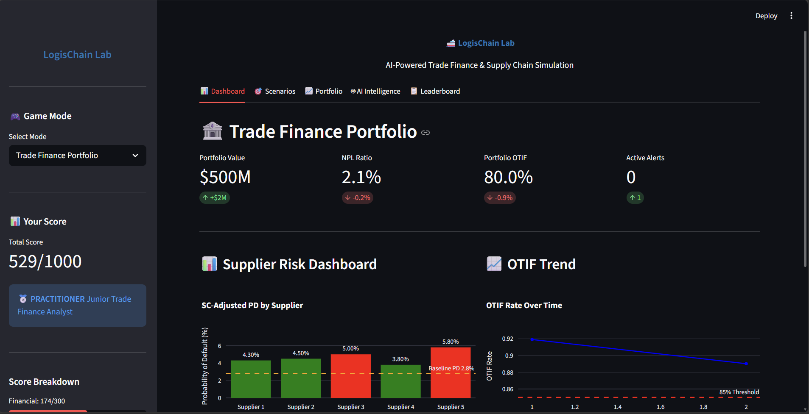
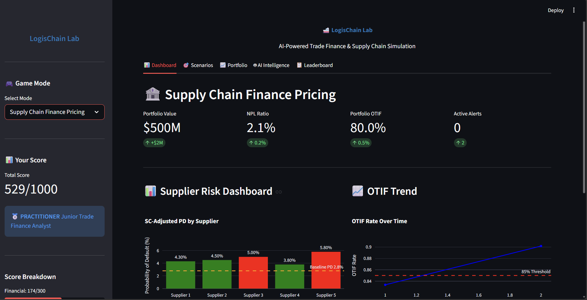
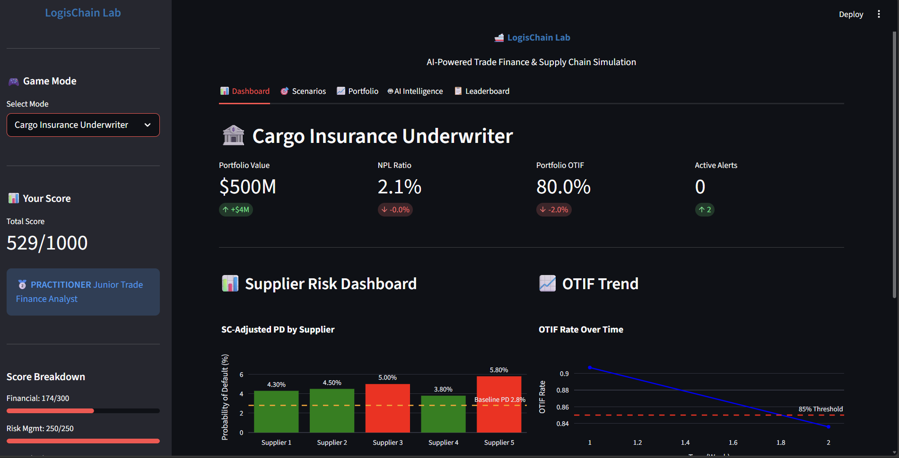
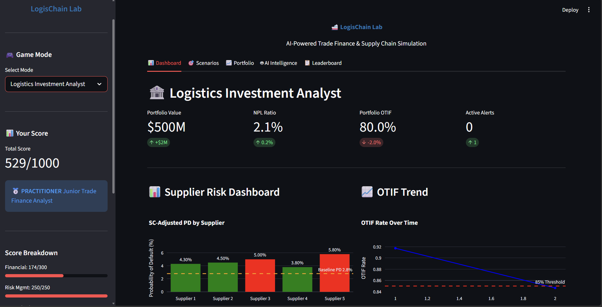

# 🚢 LogisChain AI
## Predictive Trade Finance & Logistics Valuation System


---

## 📋 Project Overview

LogisChain AI is a **dual-domain AI system** that embeds supply chain 
intelligence directly into financial risk models for:
- Trade Finance Desks
- Working Capital Management
- Supply Chain Finance (SCF) Platforms
- Credit Risk Assessment

**Submitted to:** ZeTheta Algorithms Private Limited  
**Category:** Data Science | Supply Chain Analytics | Trade Finance | AI/ML  
**Timeline:** 15 Days  

---

## 🎯 Problem Statement

Financial institutions approve Letters of Credit without checking port 
congestion. Working capital lenders extend revolving credit without 
monitoring inventory velocity. LogisChain AI closes this intelligence 
gap by integrating operational supply chain data into financial risk models.

---

## 🏗️ System Architecture

| 🏭 Physical Layer | 💰 Financial Layer | 🤖 Intelligence Layer |
|:---|:---|:---|
| **Supply Chain Operations** | **Trade Finance** | **AI Models** |
| • Port congestion data | • LC pricing & approval | • GNN risk embeddings |
| • Shipment tracking | • SCF programme mgmt | • TCN forecasting |
| • Carrier reliability | • CCC monitoring | • Transformer risk |
| • Inventory levels | • Covenant tracking | • XGBoost scoring |
| • OTIF metrics | • Credit risk scoring | • SC-PD formula |

---

## 📊 Model Performance

| Model | Metric | Our Result | Target | Status |
|-------|--------|-----------|--------|--------|
| XGBoost Credit Risk | AUC | 0.639 | > 0.771 | ⚠️ |
| GNN Supply Chain | Nodes/Edges | 210/1500 | 200+/1000+ | ✅ |
| TCN Forecasting | MAPE 30-day | 0.77% | < 12% | ✅ |
| Transformer Shipment | AUC | 0.993 | > 0.80 | ✅ |
| Trade Finance Model | Gini | 0.555 | > 0.55 | ✅ |
| CCC Prediction | AUC | 0.911 | - | ✅ |
| SC-PD Model | Risk Uplift | 65.9% | ~33% | ✅ |

---

## 🎮 LogisChain Lab — Gamified Simulation

LogisChain Lab is a **gamified simulation platform** where learners 
manage trade finance portfolios while responding to supply chain disruptions.

### Game Modes

#### Mode 1 — Trade Finance Portfolio Management


Role: Head of Trade Finance at international bank
Portfolio: $500M across 50 corporate clients
Objective: Maximize risk-adjusted return
Decisions: Approve/reject LCs, set pricing,
manage collateral requirements

#### Mode 2 — Supply Chain Finance Pricing


Role: Head of SCF Programme at global bank
Portfolio: $200M SCF programme, 500 suppliers
Objective: Maximize profitability
Decisions: Set discount rates, approve suppliers,
manage concentration limits


#### Mode 3 — Cargo Insurance Underwriter


Role: Senior Underwriter at marine cargo insurer
Book: $2B annual premiums, 1000 policies
Objective: Maintain combined ratio < 95%
Decisions: Price policies, set reserves,
implement loss prevention

#### Mode 4 — Logistics Investment Analyst


Role: Infrastructure analyst at logistics PE fund
Capital: $250M for logistics asset investment
Objective: Maximize IRR over 7-year fund life
Decisions: Acquire/divest assets, optimize network

### 🏆 Scoring System (1000 Points)

| Dimension | Points | Description |
|-----------|--------|-------------|
| Financial Performance | 300 | Risk-adjusted return, P&L |
| Risk Management | 250 | Portfolio concentration, early warning |
| SC Intelligence Use | 200 | SC data incorporation into decisions |
| Decision Speed | 100 | Response time to disruption events |
| Learning Progression | 150 | Improvement across simulation rounds |

### 🎖️ Certification Levels

| Level | Score | Badge | Industry Equivalent |
|-------|-------|-------|---------------------|
| Novice | 0-399 | 🥉 Bronze | Trainee (0-6 months) |
| Practitioner | 400-599 | 🥈 Silver | Junior Analyst |
| Specialist | 600-749 | 🥇 Gold | Senior Analyst |
| Expert | 750-899 | 🏆 Platinum | Team Lead |
| Master | 900-1000 | 💎 Diamond | Head of Trade Finance |

---

## 🚨 Scenarios Implemented

| Scenario | SC Impact | Financial Impact | Difficulty |
|----------|-----------|-----------------|------------|
| ⚓ Port Congestion | 5-15 day delays | LC expiry risk | Medium |
| 🚢 Carrier Bankruptcy | Stranded cargo | Insurance claims | High |
| 🏗️ Suez Canal Blockage | Lane shutdown | Massive freight spike | Very High |
| ⚠️ Supplier Quality Failure | Product recalls | Trade finance default | Medium |
| 📊 Demand Whiplash | ±40% swing | Covenant breach risk | High |
| 💰 Commodity Price Shock | Cost spike | Margin compression | Medium |

---

## 📈 Key Financial Models

### Supply Chain Adjusted PD (SC-PD)

From document Section A5.4:
SC-PD = Traditional PD × (1 + 0.3×OTIF_adj
+ 0.2×Inv_adj
+ 0.15×Network_adj)
Where:
OTIF_adj    = max(0, (90% - OTIF_actual) / 10%)
Inv_adj     = max(0, (6.0 - InvTurnover) / 3.0)
Network_adj = min(1.0, HHI × 2)
Our Results:
Traditional PD:  2.80%
SC-Adjusted PD:  4.65%
Risk Uplift:     65.9%

### Cash Conversion Cycle (CCC)

From document Section A2.2:
CCC = DIO + DSO - DPO
DIO = lead_times        (Days Inventory Outstanding)
DSO = shipping_times    (Days Sales Outstanding)
DPO = mfg_lead_time    (Days Payable Outstanding)
Portfolio CCC:  6.9 days
Covenant:       26.9 days
Breach Risk:    9/100 clients

---

## 🗂️ Project Structure

logischain-ai/
│
├── .gitignore
├── README.md
├── requirements.txt
│
├── data/
│   ├── raw/
│   │   └── supply_chain_data.csv
│   ├── processed/
│   │   ├── supply_chain_clean.csv
│   │   └── eda_plots/
│   │       ├── otif_by_supplier.png
│   │       ├── delay_distribution.png
│   │       ├── inventory_turnover.png
│   │       ├── correlation_heatmap.png
│   │       ├── carrier_reliability.png
│   │       └── transport_risk.png
│   └── features/
│       └── features.csv
│
├── src/
│   ├── data/
│   │   ├── data_loader.py          ← D1: Load & clean raw data
│   │   ├── eda.py                  ← D2: EDA visualizations
│   │   └── investigate.py          ← Column investigation scripts
│   ├── features/
│   │   └── feature_engineering.py  ← D3: 7 SC metrics + 55 features
│   ├── models/
│   │   ├── xgboost_model.py        ← D7: XGBoost + SHAP (AUC: 0.639)
│   │   ├── gnn.py                  ← D4: HetGAT GNN (210 nodes)
│   │   ├── tcn.py                  ← D5: TCN forecast (MAPE: 0.77%)
│   │   └── transformer.py          ← D6: Transformer (AUC: 0.993)
│   └── financial/
│       └── financial_models.py     ← D8-D10: SC-PD, CCC, TF models
│
├── demo/
│   └── app.py                      ← D11-D13: LogisChain Lab (Streamlit)
│
├── docs/
│   ├── feature_catalog.md          ← D3: 55 features documented
│   ├── patent_concept.md           ← D16: Patent concepts
│   └── screenshots/
│       ├── trade_finance.png
│       ├── supply_chain_finance.png
│       ├── cargo_insurance.png
│       └── logistics_investment.png
│
└── tests/

---

## 🚀 Installation & Setup

Python 3.10+
Windows/Mac/Linux

### Prerequisites

### Step 1: Clone Repository
```bash
git clone https://github.com/ZethetaIntern/logischain-ai
cd logischain-ai
```

### Step 2: Create Virtual Environment
```bash
python -m venv venv

# Windows
venv\Scripts\activate

# Mac/Linux
source venv/bin/activate
```

### Step 3: Install Dependencies
```bash
pip install -r requirements.txt
```

### Step 4: Run Data Pipeline
```bash
python src/data/data_loader.py
python src/features/feature_engineering.py
```

### Step 5: Run Models
```bash
python src/models/xgboost_model.py
python src/models/gnn.py
python src/models/tcn.py
python src/models/transformer.py
python src/financial/financial_models.py
```

### Step 6: Launch Simulation
```bash
streamlit run demo/app.py
```

---

## 📦 Dependencies

* **Core:** `pandas`, `numpy`, `scikit-learn`
* **Visualization:** `matplotlib`, `seaborn`, `plotly`
* **Machine Learning:** `xgboost`, `lightgbm`, `optuna`, `shap`
* **Deep Learning:** `torch`, `torch-geometric`
* **Time Series:** `darts`
* **Survival Analysis:** `lifelines`
* **Network Analysis:** `networkx`
* **Financial:** `yfinance`
* **Dashboard:** `streamlit`
* **MLOps:** `mlflow`
---

## 📊 Data Sources

| Source | Type | Use |
|--------|------|-----|
| Kaggle Supply Chain Dataset | Real (100 rows) | Primary dataset |
| Synthetic Augmentation | Generated | Model training |
| Yahoo Finance | Real | Financial benchmarks |
| ICC Trade Register | Reference | PD benchmarks |
| Document Formulas | Reference | Feature computation |

---

## ⚠️ Limitations
1. Dataset Size
    Real data: 100 rows
    Document benchmark: 42,000+ transactions
    Impact: XGBoost AUC 0.639 vs target 0.771
2. Missing Columns
    No Accounts Receivable → DSO proxy used
    No Accounts Payable → DPO proxy used
    No AIS vessel data → Synthetic port data
3. GNN Nodes
    Real suppliers: 5
    Synthetic graph: 210 nodes for training
    Impact: All real suppliers show similar risk
4. ECE Calibration
    Our ECE: 0.136 vs target 0.03
    Reason: Small dataset (59 real transactions)

---

## 🔬 Case Studies Referenced

| Case Study | Year | Financial Impact | LogisChain AI Application |
|------------|------|-----------------|--------------------------|
| Ever Given / Suez Blockage | 2021 | $9.6B/day | LC expiry detection |
| COVID Supply Chain | 2020-22 | $2.5T gap | Phase detection |
| Greensill Capital | 2021 | $10B losses | Concentration alerts |
| Hanjin Bankruptcy | 2016 | $14.5B stranded | Carrier health monitoring |
| Qingdao Port Fraud | 2014 | $3.6B fraud | Physical-financial cross-reference |

---

## 👥 Acknowledgements

- **ZeTheta Algorithms** — Project design and administration
- **ICC Trade Register** — Default rate benchmarks
- **Kaggle** — Supply chain dataset
- **PyTorch Geometric** — GNN implementation

---

## 📄 License

This project and all IP arising from submissions is the exclusive 
property of Zetheta Algorithms Private Limited as per the 
confidentiality terms accepted at project commencement.

---

*LogisChain AI v1.0 | ZeTheta Algorithms | 2026*

